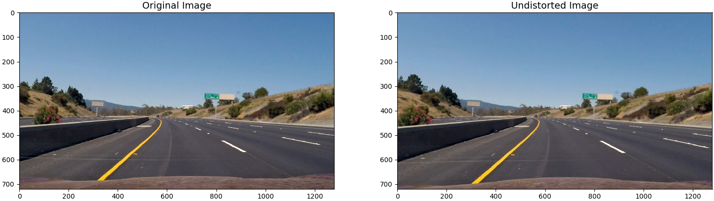
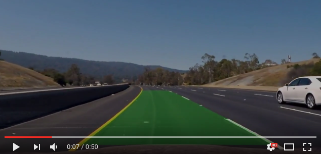

## Lane and Vehicle Detection

### Abstract
This project implements and visualizes lane detection, lane curve estimation, and vehicle position estimation algorithms for autonomous vehicle applications.
It relies on camera calibration, image distortion correction, perspective projection, lane marker detection based on the Sobel operator, and
lane curve estimation based on least squares polynomial fit. The project is tested and succeeds on a dashboard camera video feed in which
lane markers are illuminated by daylight. Future work includes developing a more robust lane marker detection algorithm that is 
not defeated by poor illumination and strong image gradients not associated with lane markings.

### Installation 
This procedure was tested on Ubuntu 16.04 (Xenial Xerus) and Mac OS X 10.11.6 (El Capitan). Install Python package 
dependencies using [my instructions.](https://github.com/alexhagiopol/deep_learning_packages) Then, activate the environment:

    source activate deep-learning

Get the project:
    
    git clone git@github.com:alexhagiopol/vehicle_perception.git
    cd vehicle_perception
    git submodule update --init

Get example datasets:

    wget -O datasets.zip "https://www.dropbox.com/s/uzual4vchhzms1d/datasets.zip?dl=1"
    unzip datasets.zip

### Execution
Perform camera calibration:

    python camera_calibration/calibrate.py -ch 6 -cw 9 -cd datasets/calibration_images/ -p camera_info.p

Run the pipeline:
    
    python main.py -p camera_info.p -vid datasets/test_videos/ -vod output/

### Technical Report
#### Camera Calibration and Distortion Correction
This part of the project is included as a submodule of the vehicle_perception project in the `camera_calibration` directory. 
The functions `compute_point_locations()` and `compute_calibration_matrix()` in the file `calibrate.py` implement camera calibration. Part of the example dataset provided
is a set of images of a 9x6 chessboard. The method implemented closely follows the camera calibration procedure described in
[the OpenCV documentation](http://docs.opencv.org/2.4/doc/tutorials/calib3d/camera_calibration/camera_calibration.html). 
A set of points in the world space is first specified to match the 9x6 arrangement of chessboard squares. Then, due to the 
strong gradient at corners in the chessboard, all chessboard corners are reliably identifiable in each image. Given that 
each image now has an associated set of corners, global Levenberg-Marquardt optimization can be used to find a combination 
of camera parameters that minimize the reprojection errors of the chessboard corners. The camera parameters estimated by 
the camera calibration step contain the distortion coefficients which when used to compose a transformation matrix, are
used to undistort the input image in the function`undistort_image`. The figure below shows an exaggerated example of image distortion correction. A GoPro
camera with a fisheye lens produces an image of a horizon in which the horizon has an impossible curvature. Distortion 
correction makes straight lines in the scene appear as straight lines in the image:

When applied to images from the dashboard camera dataset, distortion correction has a much less noticeable effect:

#### Lane Marker Detection

#### Perspective Transform

#### Lane Curve Equation and Curvature Radius Estimation

#### Single Frame Pipeline Result

#### Demo Video

