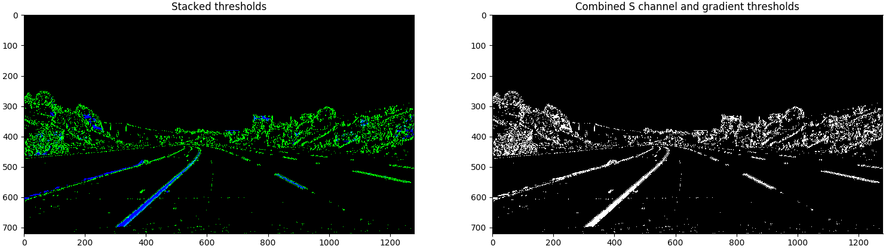
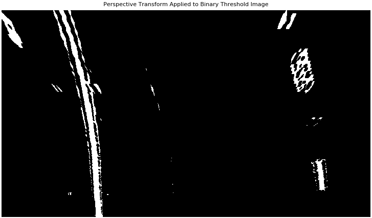
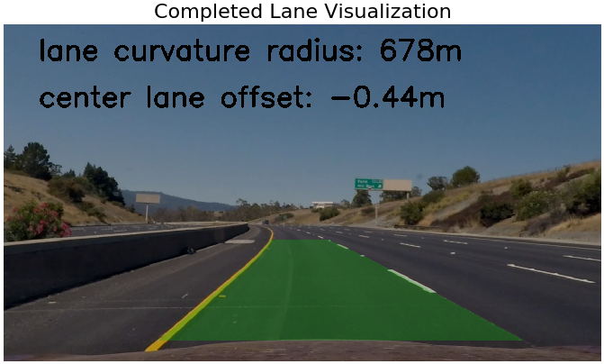

## Lane and Vehicle Detection

### Abstract
This project implements and visualizes lane detection, lane curve estimation, and vehicle position estimation algorithms for autonomous vehicle applications.
It relies on camera calibration, image distortion correction, perspective projection, lane marker detection based on the Sobel operator, and
lane curve estimation based on least squares polynomial fit. The project is tested and succeeds on a dashboard camera video feed in which
lane markers are illuminated by daylight. Future work includes developing a more robust lane marker detection algorithm that is 
not defeated by poor illumination and strong image gradients not associated with lane markings.

### Installation 
This procedure was tested on Ubuntu 16.04 (Xenial Xerus) and Mac OS X 10.11.6 (El Capitan). Install Python package 
dependencies using [my instructions.](https://github.com/alexhagiopol/deep_learning_packages) Then, activate the environment:

    source activate deep-learning

Get the project:
    
    git clone git@github.com:alexhagiopol/vehicle_perception.git
    cd vehicle_perception
    git submodule update --init

Get example datasets:

    wget -O datasets.zip "https://www.dropbox.com/s/uzual4vchhzms1d/datasets.zip?dl=1"
    unzip datasets.zip

### Execution
Perform camera calibration:

    python camera_calibration/calibrate.py -ch 6 -cw 9 -cd datasets/calibration_images/ -p camera_info.p

Run the pipeline:
    
    python main.py -p camera_info.p -vid datasets/test_videos/ -vod output/

### Technical Report: Lane Detection
#### Lane Detection: Camera Calibration and Distortion Correction
This part of the project is included as a submodule of the vehicle_perception project in the `camera_calibration` directory. 
The functions `compute_point_locations()` and `compute_calibration_matrix()` in the file `calibrate.py` implement camera calibration. Part of the example dataset provided
is a set of images of a 9x6 chessboard. The method implemented closely follows the camera calibration procedure described in
[the OpenCV documentation](http://docs.opencv.org/2.4/doc/tutorials/calib3d/camera_calibration/camera_calibration.html). 
A set of points in the world space is first specified to match the 9x6 arrangement of chessboard squares. Then, due to the 
strong gradient at corners in the chessboard, all chessboard corners are reliably identifiable in each image. Given that 
each image now has an associated set of corners, global Levenberg-Marquardt optimization can be used to find a combination 
of camera parameters that minimize the reprojection errors of the chessboard corners. The camera parameters estimated by 
the camera calibration step contain the distortion coefficients which when used to compose a transformation matrix, are
used to undistort the input image in the function`undistort_image`. The figure below shows an exaggerated example of image distortion correction. A GoPro
camera with a fisheye lens produces an image of a horizon in which the horizon has an impossible curvature. Distortion 
correction makes straight lines in the scene appear as straight lines in the image:

When applied to images from the dashboard camera dataset, distortion correction has a much less noticeable effect:

#### Lane Detection: Lane Marker Detection
In the file `lane_detection.py`, the function `lane_marker_detection()` converts an undistorted RGB image into a binary
image in which lane markers appear clearly. The function first converts the image to grayscale, then applies the Sobel
operator to compute the gradient in the x direction. The function then filters the Sobel image with two theresholds: (1)
a gradient value threshold and (2) a color value threshold. Pixels which meet the requirements for either threshold are set to 1
while all other pixels are set to 0. The following is an example of binary thresholding:

 
#### Lane Detection: Perspective Transform
After binary thresholding, the function `lane_detection_pipeline()` in `lane_detection.py` computes a homography matrix
using `compute_forward_to_top_perspective_transform()`. This function uses a group of manually selected matching point pairs
to compute a homography that transforms a forward facing image to a top-down facing image. The homography matrix is applied 
to the binary thresholded image using OpenCV's `warpPerspective()`. Following this operation, OpenCV's `erode()` is used
to remove noise from the detected lane lines. Below is an example result:

#### Lane Detection: Lane Curve Equation and Curvature Radius Estimation
After the binary threshold image is warped above, each pixel in the resulting image must be used to compute lane curve equations
using polynomial least squares error fit. The pixels used for this calculation are identified via a window-based search
algorithm implemented in the function `estimate_lane_lines()`. The sliding window search method identifies windows in the 
input image with the highest concentrations of non-zero pixels. A histogram of pixel values along columns is used to initialize 
the search. An example of window-based search results is below:

Once the pixels believed to belong to lane markings are identified, the least squares error polyomial fit for each lane line is
computed using NumPy's `polyfit()` function. This line is represented as a set of coefficients in the equation y = Ax^2 + Bx + C
where y, x, A, B, and C are in pixel dimensions. To estimate a conversion to meters, we use the U.S. standard lane width values
to create a conversion factor. We can then convert the binary lane marker pixel locations into world coordinates and recompute
the lane curve coefficients in world coordinates. This leads to the computation of the lane curvature radius in meters
([reference](https://en.wikipedia.org/wiki/Radius_of_curvature)) and the computation of the offset between the center column
of the image and the center of the lane in meters.

By sampling points from the curve defined by the coefficients, we are able to produce a set of points 
that define a many-sided polygon. By warping these points into a front-view perspective using the function `compute_top_to_forward_perspective_transform()`
in `lane_detection.py` and OpenCV's `warpPerspective()`, we create a polygon in the front view that highlights the lane in
front of the vehicle. This graphical work is done by the `display_info()` function in `lane_detection.py`.
 
#### Lane Detection: Results - Single Video Frame
Below is an example of the result of performing the above series of processing steps on a single video frame:

#### Lane Detection: Results - Video
Below is the result of performing the above series of processing steps on each video frame of a dashboard camera:

#### Lane Detection: Conclusions and Future Work
Upon visual inspection, the method described in this project performs satisfactorily on the video provided in the YouTube link
above. However, testing on other datasets reveals the fundamental weak point of the project which is the robustness of the 
lane marker detection algorithm. Color and gradient value thresholding can be defeated by illumination and geometry artifacts
in the image. For example, cracks or seams in the pavement can appear to be lane lines because they represent strong gradients
as computed by the Sobel method. Future work includes better tuning of the current lane marker detection procedure. Another
approach is to implement a neural network based approach on diverse datasets with labeled lane marker pixels. This would require 
a massive amount of manual labor that would likely pay off with production-grade accuracy.